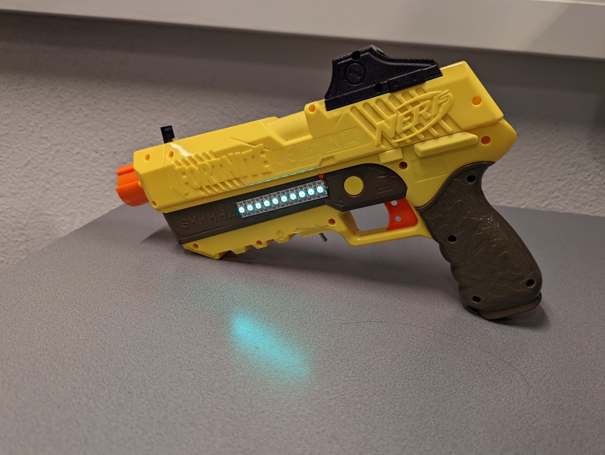
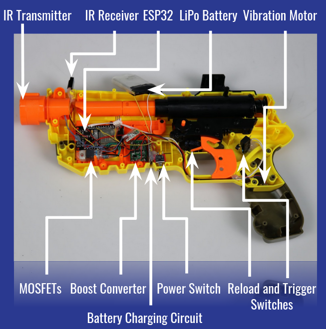
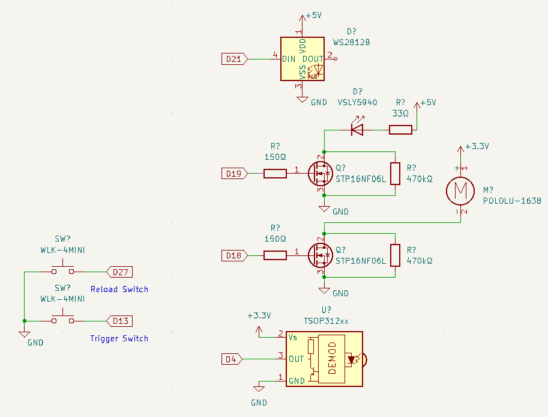
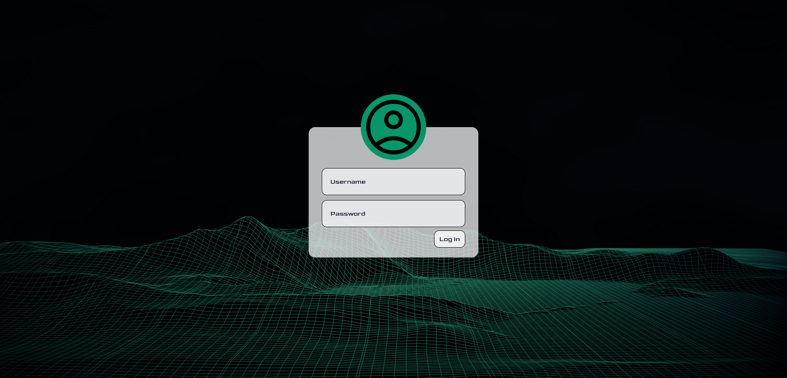
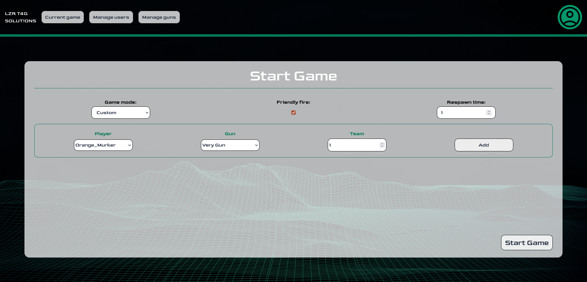

# A Laser Tag game based on the ESP32 platform

The system consists of two main parts:

1. The game server
2. Guns

### Features

* Role based permissions
  * Player
    * See current game statistics
      * Player Name
      * Player Health
      * Deaths
      * Shots Fired
      * Team Number
      * Gun ID
  * Game Master
    * Everything that a player can
    * Create, start and end games
  * Admin
    * Everything that a game master can
    * Manage users
    * Manage guns
* Player health displayed on the gun
* Haptic feedback for shooting and getting shot
* Game modes
  * Solo Deathmatch
  * Team Deathmatch
  * Solo Battle Royale
  * Team Battle Royale
  * Custom
    * Friendly Fire
    * Respawn time (s)
* Up to 255 guns

---

## Guns

### Hardware

Each gun is based on a modified Nerf Fortnite SP-L blaster which I can confirm all the hardware to fit into but you can just use your creativity and make a different blaster

Components List:

* ESP32-WROOM
* 2x WLK-4MINI switch
  * Trigger switch
  * Reload switch
* TSOP31238 IR Receiver
* VSLY5940 IR LED
* WS2812 LED Strip
* 2x STP16NF06L MOSFET
* POLOLU-1638 Vibration Motor
* 2x 470kΩ resistor
* 2x 150Ω resistor
* 33Ω resistor

See schematic below:

Additions for a battery powered gun:
* TP4056 based battery charging circuit
* Power switch
* Boost converter (battery voltage to 5V)

### Software

Before flashing the firmware make sure to:

* Set a unique gun ID(0-255) in `game.h` and write it down somewhere.
* Generate a random token of more than 20 characters in length for each gun, set it in `wifi_communication.h` and write it down somewhere.
* Set Wi-Fi ssid and password in `wifi_communication.h`
* Set the correct IP address for your server in `wifi_communication.h`

One of the easiest ways to upload the firmware is to install the PlatformIO extension for VSCode, open the project in VSCode and click the upload button at the bottom left of the screen.

Guns and send their current status and poll the server for an update at the same time via a POST request. See the API documentation for more details. Authentication is done using a bearer token.

---

## Server

You can use the provided `docker-compose.yml` file to start the game server.

React based frontend.

Backend is based on NestJS and TypeORM. PostgreSQL is used as a database.

Database is already set up in the provided docker image.
